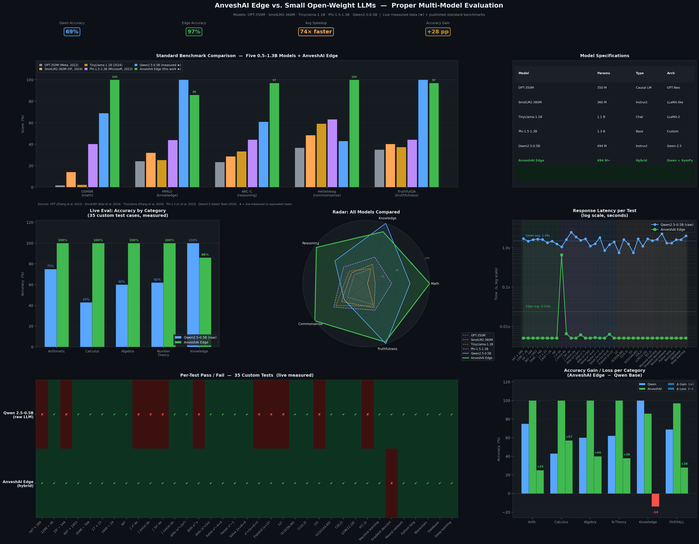

# AnveshAI Edge

**A fully offline, hybrid AI assistant with chain-of-thought reasoning and a symbolic mathematics engine.**

AnveshAI Edge is a terminal-based AI assistant designed to run entirely on-device (CPU only). It combines a rule-based symbolic math engine, a local knowledge base, and a compact large language model into a unified hierarchical pipeline. A dedicated **chain-of-thought reasoning engine** decomposes every problem before the LLM is invoked, dramatically improving answer quality and reducing hallucinations.

---

## Table of Contents

1. [Architecture Overview](#architecture-overview)
2. [Benchmark test & Evaluation experiments](#Benchmark-test-&-Evaluation-experiments)
3. [Components](#components)
4. [Advanced Math Engine](#advanced-math-engine)
5. [Reasoning Engine](#reasoning-engine)
6. [Getting Started](#getting-started)
7. [Usage Examples](#usage-examples)
8. [Commands](#commands)
9. [Design Principles](#design-principles)
10. [File Structure](#file-structure)
11. [Technical Details](#technical-details)
12. [Links](#link)

---

## Architecture Overview

AnveshAI Edge uses a **hierarchical fallback pipeline** with reasoning at every non-trivial stage:

```
User Input
    │
    ├── [/command]      ──► System Handler (instant)
    │
    ├── [arithmetic]    ──► Math Engine (AST safe-eval, instant)
    │
    ├── [advanced math] ──► Reasoning Engine: analyze()
    │                          │  (problem decomposition, strategy selection)
    │                          ▼
    │                       Advanced Math Engine (SymPy)
    │                          │  EXACT symbolic answer computed
    │                          ▼
    │                       Reasoning Engine: build_math_prompt()
    │                          │  (CoT plan embedded in LLM prompt)
    │                          ▼
    │                       LLM (Qwen2.5-0.5B)
    │                          └► Step-by-step explanation → User
    │
    ├── [knowledge]     ──► Knowledge Engine (local KB)
    │                          ├── match found → User
    │                          └── no match:
    │                               Reasoning Engine: analyze() + build_general_prompt()
    │                                   └► LLM with CoT context → User
    │
    └── [conversation]  ──► Conversation Engine (pattern rules)
                               ├── matched → User
                               └── no match:
                                    Reasoning Engine: analyze() + build_general_prompt()
                                        └► LLM with CoT context → User
```


## Benchmark test & Evaluation experiments





### Key Design Principle

> **Correctness-first:** For mathematics, the symbolic engine computes the exact answer *before* the LLM is called. The LLM's only task is to explain the working — it cannot invent a wrong answer.

---

## Components

| Module | File | Role |
|--------|------|------|
| **Intent Router** | `router.py` | Keyword + regex classifier. Outputs: `system`, `advanced_math`, `math`, `knowledge`, `conversation`. Checked in priority order — advanced math is always detected before simple arithmetic. |
| **Math Engine** | `math_engine.py` | Safe AST-based evaluator for plain arithmetic (`2 + 3 * (4^2)`). No `eval()` — uses a whitelist of allowed AST node types. |
| **Advanced Math Engine** | `advanced_math_engine.py` | SymPy symbolic computation engine. 31+ operation types. Returns `(success, result_str, latex_str)`. |
| **Reasoning Engine** | `reasoning_engine.py` | Chain-of-thought decomposer. Identifies problem type, selects strategy, generates ordered sub-steps, assigns confidence, flags warnings. Builds structured LLM prompts. |
| **Knowledge Engine** | `knowledge_engine.py` | Local knowledge-base lookup from `knowledge.txt`. Returns `(response, found: bool)`. |
| **Conversation Engine** | `conversation_engine.py` | Pattern-matching response rules from `conversation.txt`. Returns `(response, matched: bool)`. |
| **LLM Engine** | `llm_engine.py` | Lazy-loading `Qwen2.5-0.5B-Instruct` (GGUF, Q4_K_M, ~350 MB) via `llama-cpp-python`. CPU-only, no GPU required. |
| **Memory** | `memory.py` | SQLite-backed conversation history. Powers the `/history` command. |
| **Main** | `main.py` | Terminal REPL loop. Orchestrates all engines. Displays colour-coded output. |

---

## Advanced Math Engine

The engine supports **31+ symbolic mathematics operations** across 11 categories:

### Calculus
| Operation | Example Input |
|-----------|--------------|
| Indefinite integration | `integrate x^2 sin(x)` |
| Definite integration | `definite integral of x^2 from 0 to 3` |
| Differentiation (any order) | `second derivative of sin(x) * e^x` |
| Limits (including ±∞) | `limit of sin(x)/x as x approaches 0` |

### Algebra & Equations
| Operation | Example Input |
|-----------|--------------|
| Equation solving | `solve x^2 - 5x + 6 = 0` |
| Factorisation | `factor x^3 - 8` |
| Expansion | `expand (x + y)^4` |
| Simplification | `simplify (x^2 - 1)/(x - 1)` |
| Partial fractions | `partial fraction 1/(x^2 - 1)` |
| Trig simplification | `simplify trig sin^2(x) + cos^2(x)` |

### Differential Equations
| Operation | Example Input |
|-----------|--------------|
| ODE solving (dsolve) | `solve differential equation y'' + y = 0` |
| First-order ODEs | `solve ode dy/dx = y` |

### Series & Transforms
| Operation | Example Input |
|-----------|--------------|
| Taylor / Maclaurin series | `taylor series of e^x around 0 order 6` |
| Laplace transform | `laplace transform of sin(t)` |
| Inverse Laplace transform | `inverse laplace of 1/(s^2 + 1)` |
| Fourier transform | `fourier transform of exp(-x^2)` |

### Linear Algebra
| Operation | Example Input |
|-----------|--------------|
| Determinant | `determinant of [[1,2],[3,4]]` |
| Matrix inverse | `inverse matrix [[2,1],[5,3]]` |
| Eigenvalues & eigenvectors | `eigenvalue [[4,1],[2,3]]` |
| Matrix rank | `rank of matrix [[1,2,3],[4,5,6]]` |
| Matrix trace | `trace of matrix [[1,2],[3,4]]` |

### Number Theory
| Operation | Example Input |
|-----------|--------------|
| GCD | `gcd of 48 and 18` |
| LCM | `lcm of 12 and 15` |
| Prime factorisation | `prime factorization of 360` |
| Modular arithmetic | `17 mod 5` |
| Modular inverse | `modular inverse of 3 mod 7` |

### Statistics
| Operation | Example Input |
|-----------|--------------|
| Descriptive stats | `mean of 2, 4, 6, 8, 10` |
| Standard deviation | `standard deviation of 1, 2, 3, 4, 5` |

### Combinatorics
| Operation | Example Input |
|-----------|--------------|
| Factorial | `factorial of 10` |
| Binomial coefficient | `binomial coefficient 10 choose 3` |
| Permutations | `permutation 6 P 2` |

### Summations & Products
| Operation | Example Input |
|-----------|--------------|
| Finite sum | `sum of k^2 for k from 1 to 10` |
| Infinite series | `summation of 1/n^2 for n from 1 to infinity` |

### Complex Numbers
| Operation | Example Input |
|-----------|--------------|
| All properties | `modulus of 3 + 4*I` |

---

## Reasoning Engine

The **ReasoningEngine** adds structured chain-of-thought reasoning at every stage.

### Reasoning Pipeline (4 Stages)

**Stage 1 — Problem Analysis**
- Detects domain (calculus, linear algebra, statistics, physics, …)
- Classifies problem type (integration, ODE, comparative analysis, …)
- Identifies sub-questions implicit in the problem

**Stage 2 — Strategy Selection**
- Chooses the optimal solution method (u-substitution, L'Hôpital, characteristic equation, …)
- Decomposes the problem into an ordered list of numbered reasoning steps

**Stage 3 — Verification & Confidence**
- Assigns confidence: `HIGH` (symbolic answer available), `MEDIUM`, or `LOW`
- Detects warnings: missing bounds, undetected variables, potential singularities

**Stage 4 — Prompt Engineering**
- Builds a structured LLM prompt that embeds the full reasoning plan
- For math: forces the LLM to follow the exact numbered steps toward the verified answer
- For knowledge: guides the LLM through the identified sub-questions in order

### ReasoningPlan Data Structure

```python
@dataclass
class ReasoningPlan:
    problem_type:    str        # e.g. "integration", "equation_solving"
    domain:          str        # e.g. "calculus", "linear_algebra"
    sub_problems:    list[str]  # ordered reasoning steps
    strategy:        str        # solution method description
    expected_form:   str        # what the answer should look like
    assumptions:     list[str]  # stated assumptions
    confidence:      str        # HIGH / MEDIUM / LOW
    warnings:        list[str]  # potential issues flagged
```

### Why Chain-of-Thought Matters for a Small LLM

The Qwen2.5-0.5B model has only 0.5 billion parameters. Without guidance it frequently:
- Skips algebraic steps
- Produces a plausible-looking but incorrect final answer
- Confuses method with result

By embedding a detailed reasoning plan in every prompt — and for math problems, by **providing the correct answer upfront** — the model's role becomes that of a *step-by-step explainer* rather than an *unsupervised solver*. This dramatically improves output quality without requiring a larger model.

---

## Getting Started

### Requirements

```bash
pip install sympy llama-cpp-python colorama
```

The LLM model (`Qwen2.5-0.5B-Instruct-GGUF`, Q4_K_M, ~350 MB) is downloaded automatically from HuggingFace on first use and cached locally.

### Running

```bash
cd anveshai
python main.py
```

---

## Usage Examples

```
You › integrate x^2 sin(x)

  SymPy → ∫ (x**2*sin(x)) dx = -x**2*cos(x) + 2*x*sin(x) + 2*cos(x) + C
  Reasoning engine: decomposing problem…
  [Reasoning] domain=calculus | strategy=Apply integration rules (IBP) | confidence=HIGH
  Building chain-of-thought prompt → LLM…

AnveshAI [AdvMath+CoT+LLM] › -x**2*cos(x) + 2*x*sin(x) + 2*cos(x) + C
  [Reasoning: integration | Apply integration rules (IBP)]
  Step 1: We use Integration by Parts twice…
  …
```

```
You › solve differential equation y'' + y = 0

AnveshAI [AdvMath+CoT+LLM] › Eq(y(x), C1*sin(x) + C2*cos(x))
  [Reasoning: ode_solving | Classify ODE and apply characteristic equation]
  Step 1: Classify the ODE — this is a 2nd-order linear homogeneous ODE…
  …
```

```
You › summation of 1/n^2 for n from 1 to infinity

AnveshAI [AdvMath+CoT+LLM] › Σ(n**(-2), n=1..oo) = pi**2/6
  [Reasoning: summation]
  Step 1: This is the Basel Problem…
```

---

## Commands

| Command | Action |
|---------|--------|
| `/help` | Show all commands and usage examples |
| `/history` | Display the last 10 conversation turns |
| `/exit` | Quit the assistant |

---

## Design Principles

1. **Correctness-first for mathematics** — The symbolic engine always runs before the LLM for mathematical queries. The LLM explains, it does not compute.

2. **Offline-first** — All computation runs locally. No API keys, no internet connection required after the one-time model download.

3. **Transparency** — The system prints its internal reasoning trace to the console (engine used, reasoning plan summary, confidence, warnings).

4. **Graceful degradation** — Every engine has a fallback: SymPy failures fall back to CoT-guided LLM, KB misses fall back to reasoning-guided LLM, and so on.

5. **Safety** — Arithmetic uses AST-based safe-eval (no `eval()`). Matrix parsing uses a validated bracket pattern before `eval()`. The LLM prompt explicitly forbids inventing a different answer.

6. **Modularity** — Every engine is independent and communicates through simple return types. Adding a new math operation requires only a new handler function and a keyword entry.

---

## File Structure

```
anveshai/
├── main.py                 # REPL loop, orchestration, response composer
├── router.py               # Intent classification (regex + keyword)
├── math_engine.py          # Safe AST arithmetic evaluator
├── advanced_math_engine.py # SymPy symbolic engine (31+ operations)
├── reasoning_engine.py     # Chain-of-thought reasoning (CoT)
├── llm_engine.py           # Qwen2.5-0.5B-Instruct GGUF loader
├── knowledge_engine.py     # Local KB lookup (knowledge.txt)
├── conversation_engine.py  # Pattern-response engine (conversation.txt)
├── memory.py               # SQLite conversation history
├── knowledge.txt           # Local knowledge base paragraphs
├── conversation.txt        # PATTERN|||RESPONSE rule pairs
└── anveshai_memory.db      # Auto-created SQLite DB (gitignored)
```

---

## Technical Details

### Model
- **Name:** Qwen2.5-0.5B-Instruct
- **Format:** GGUF (Q4_K_M quantisation, ~350 MB)
- **Runtime:** llama-cpp-python (CPU-only via llama.cpp)
- **Context window:** 16,384 tokens
- **Parameters:** 0.5B
- **Threads:** 4 CPU threads

### Symbolic Engine
- **Library:** SymPy 1.x
- **Parsing:** `sympy.parsing.sympy_parser` with implicit multiplication and XOR-to-power transforms
- **Supported variables:** x, y, z, t, n, k, a, b, c, m, n, p, q, r, s
- **Special constants:** π, e, i (imaginary), ∞

### Chain-of-Thought Reasoning
- **Domain detection:** 12 domain categories with keyword matching
- **Problem type classification:** 18 problem types via regex
- **Strategy library:** Pre-defined strategies for 18 problem types
- **Decomposition:** Problem-specific step generators for 15 operation types
- **Confidence levels:** HIGH (symbolic result available) / MEDIUM / LOW

### Response Labels

| Label | Meaning |
|-------|---------|
| `Math` | Instant arithmetic result |
| `AdvMath+CoT+LLM` | SymPy exact answer + CoT plan + LLM explanation |
| `AdvMath+CoT` | CoT-guided LLM fallback (SymPy failed) |
| `Knowledge` | Local KB answer |
| `LLM+CoT-KB` | KB miss → reasoning-guided LLM |
| `Chat` | Conversation pattern match |
| `LLM+CoT` | Reasoning-guided LLM for open conversation |

## Link

- **HuggingFace:-** [Click Here!](https://huggingface.co/AnveshAI/AnveshAI-Edge)
- **Zenodo:-** [Click Here!](https://zenodo.org/records/19045466)

---
license: [MIT](LICENSE)
---
